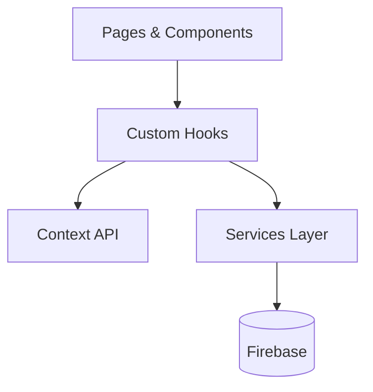

## Nossos Filmes

[](#)
[](#)
[](#)
[](#)

An application to manage, filter, and track movies collaboratively, making it easy to decide what to watch next.

### About

Keeping track of movies you want to watch and the ones you have already watched can be tricky, especially when choosing with others. This application solves that by providing a centralized list where you can manage movies, filter them by watched status, and even use a "Choose for me" feature to pick a random unwatched movie.

### Application

The application is a Single Page Application (SPA) built with React and Vite. It leverages modern web development practices and includes the following features:

- Movie management (Add, filter, and track watched/unwatched)
- "Choose for me" random movie selector
- Persistent user preferences via Local Storage
- Real-time data integration with Firebase

The project follows a component-based modular architecture and is organized into the following main layers:



#### Pages & Components
Contains the user interface, separating layout from logic. `Pages` map to specific application routes, while `Components` provide modular, reusable, and responsive UI elements.

#### Custom Hooks & Context
Encapsulates complex logic and state management. Custom hooks are used for filtering data, interacting with `React Query` for data fetching, and handling local storage configurations. The Context API manages global states.

#### Services
Responsible for data access and storage operations. It acts as an abstraction layer for interacting with Firebase, ensuring the UI layers do not directly depend on the database implementation.

#### Utils, Config & Common
Contains helper formatting functions, application-wide configurations, and shared styles, maintaining a clean and DRY (Don't Repeat Yourself) codebase.

### Requirements
- [Node.js](https://nodejs.org/)
- [pnpm](https://pnpm.io/)

### How to use

Clone the repository

```bash
  git clone "git@github.com:wendellmoraisz/nossos-filmes.git"
  cd nossosfilmes
```

Install the dependencies and run the development server:

```bash
  # Install dependencies
  pnpm install

  # Run the application
  pnpm dev
```

### Running Tests

This project uses Vitest for testing. You can run the tests using the following commands:

```bash
  # Run all tests
  pnpm test

  # Run tests in watch mode
  pnpm test:watch

  # Run unit tests
  pnpm test:unit

  # Run browser tests
  pnpm test:browser
```
